# Task 1 - CRUD with Curl in Trello API:

## Create CURL request using an API - Basic CRUD(Read, Create, Update, Delete):

### Authentication:

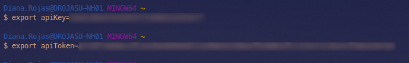

### POST:

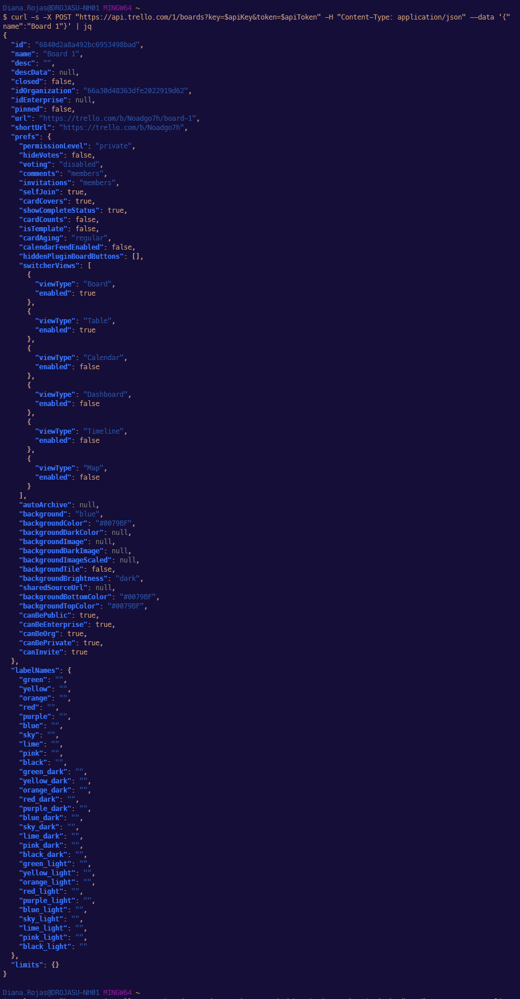

### GET:

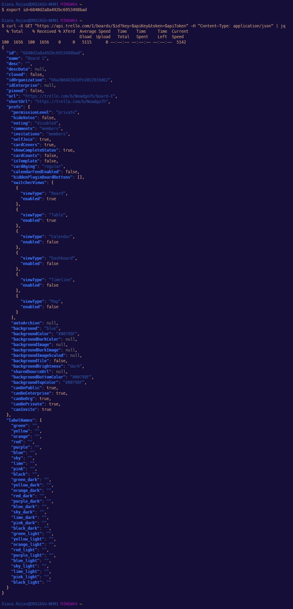

### PUT:

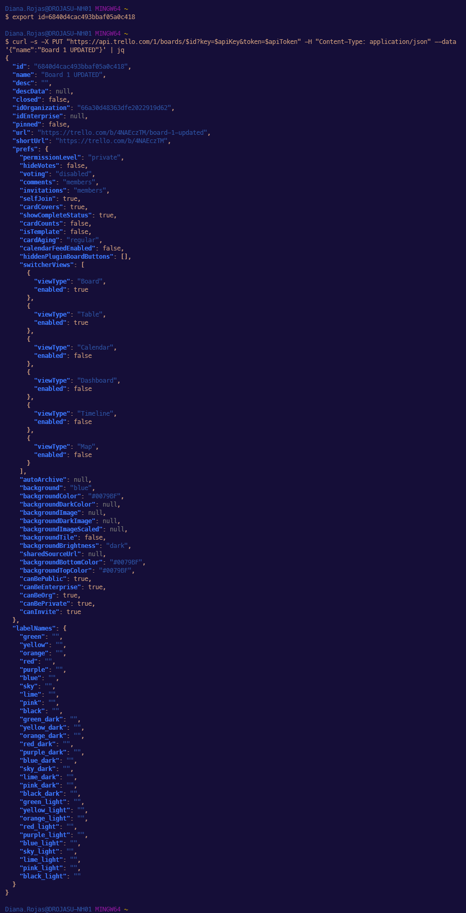

### DELETE:

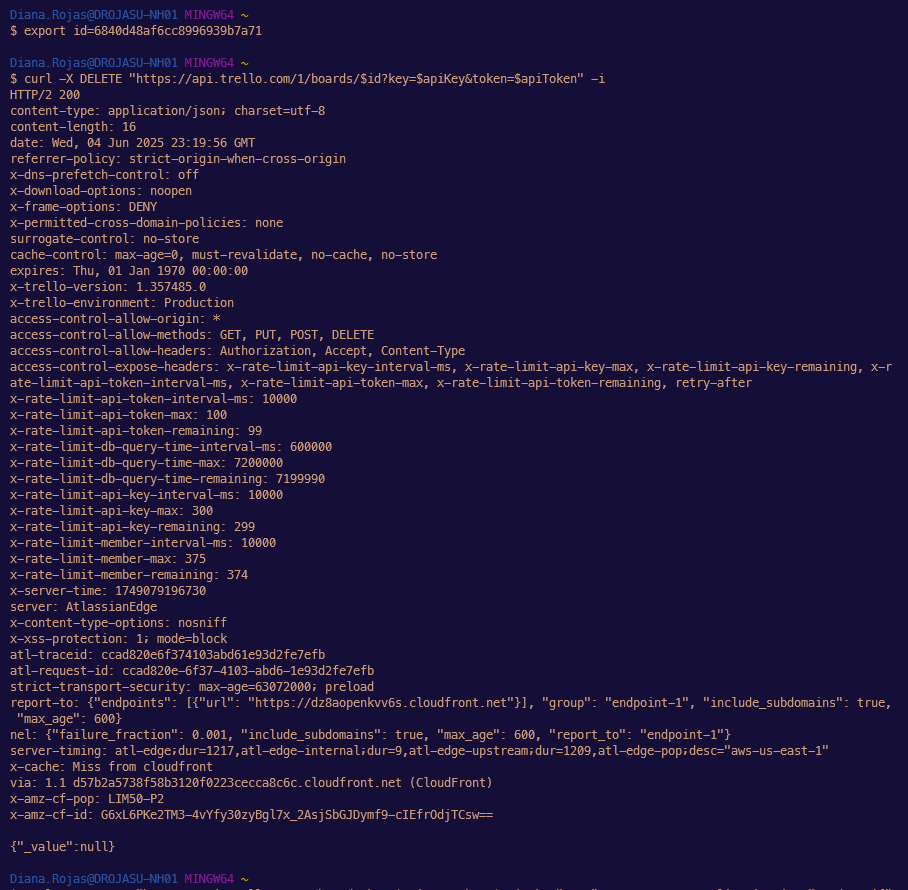

## Negative cases:

### 1. POST without Authentication

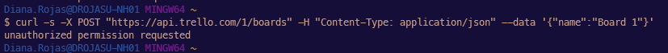

### 2. POST with invalid key:

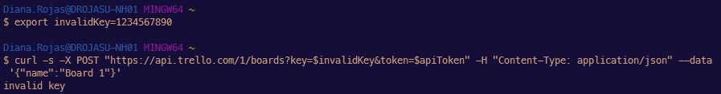

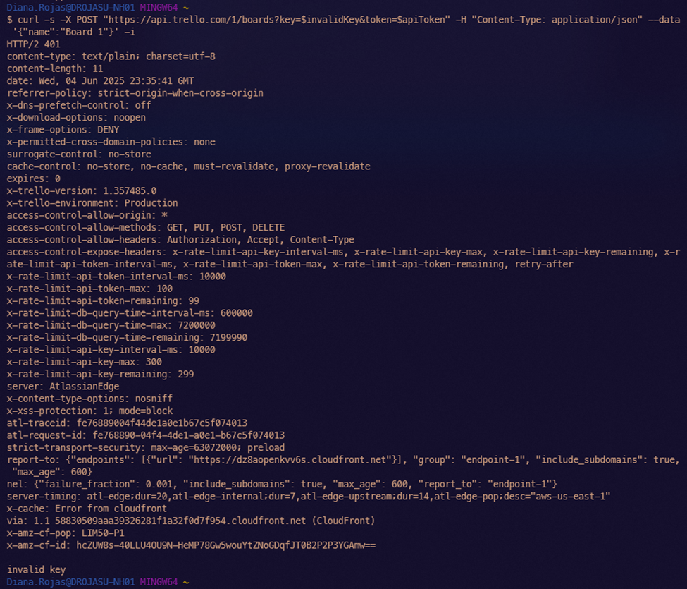

### 3. POST with invalid token:

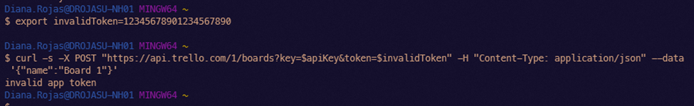

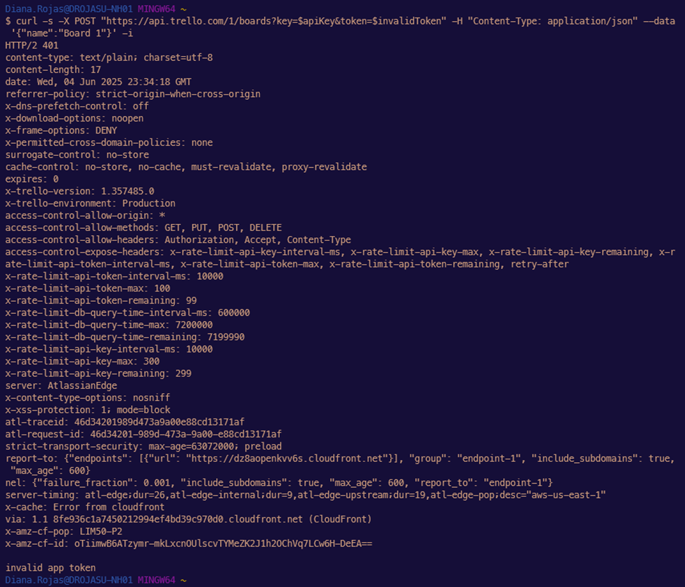

### 4. GET with non eixting ID:

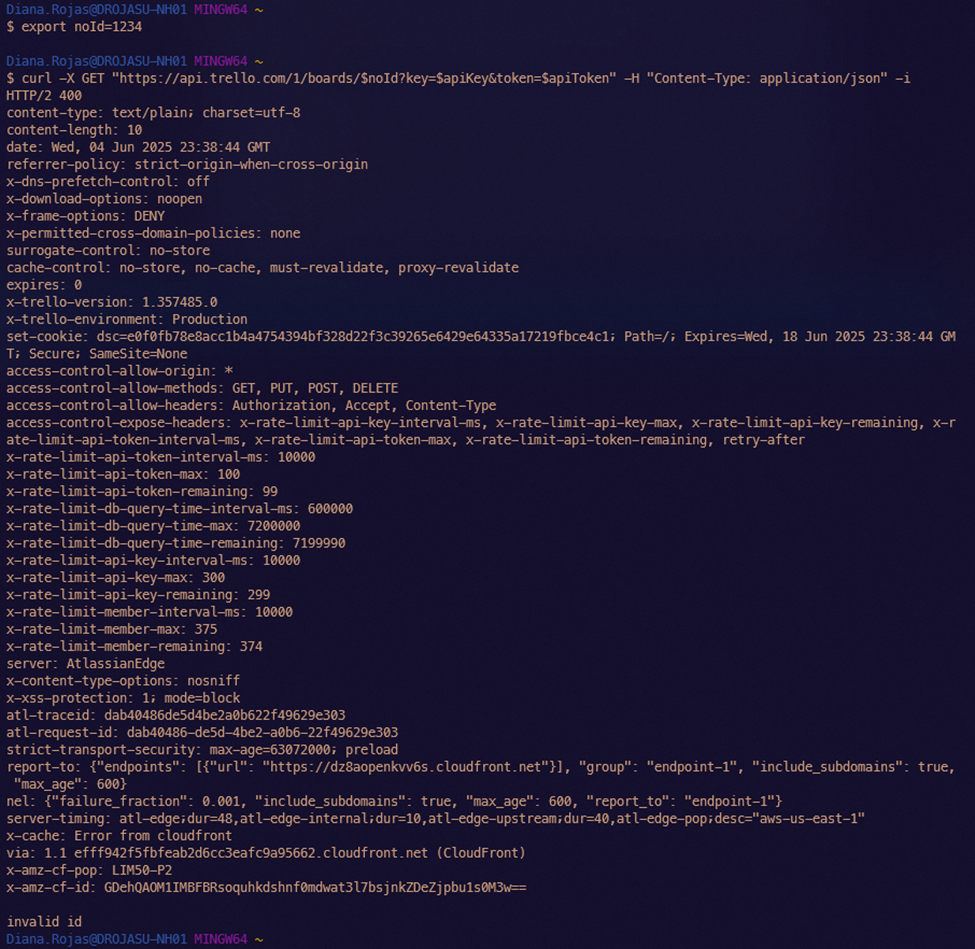

### 5. PUT with non eixting ID:

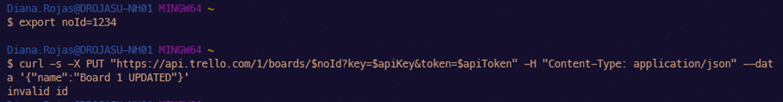

### 6. DELETE with non eixting ID:

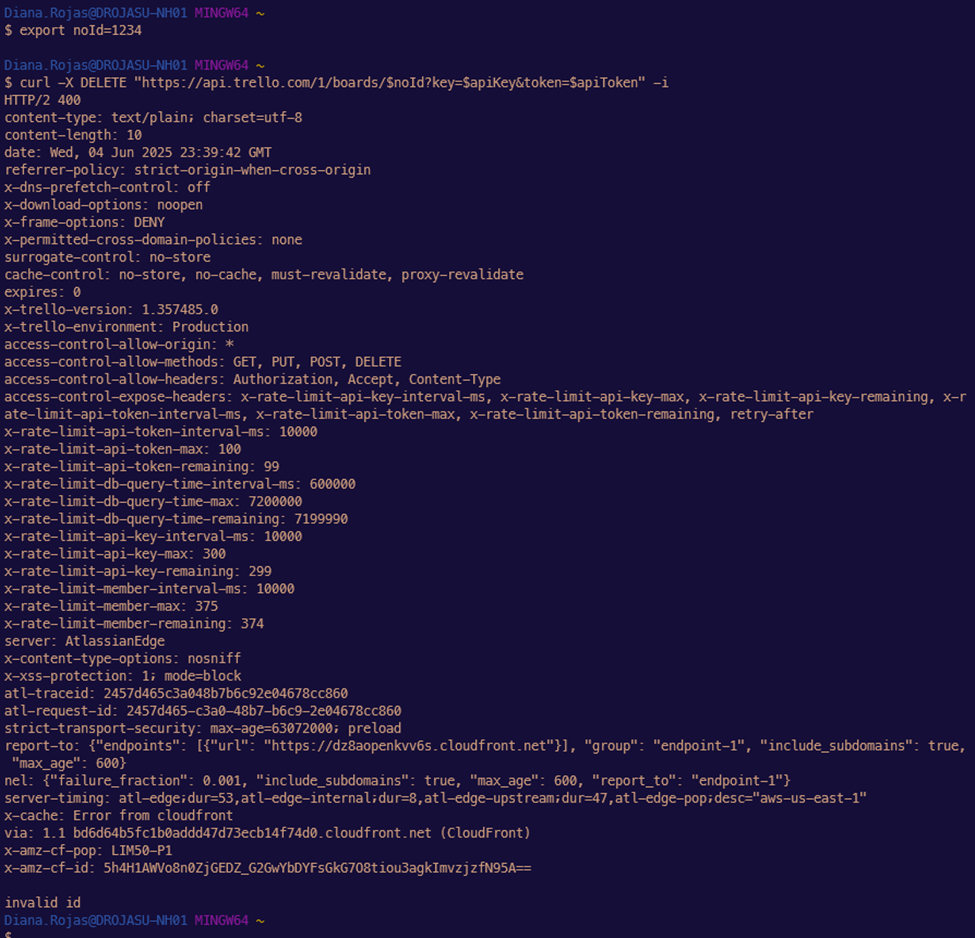